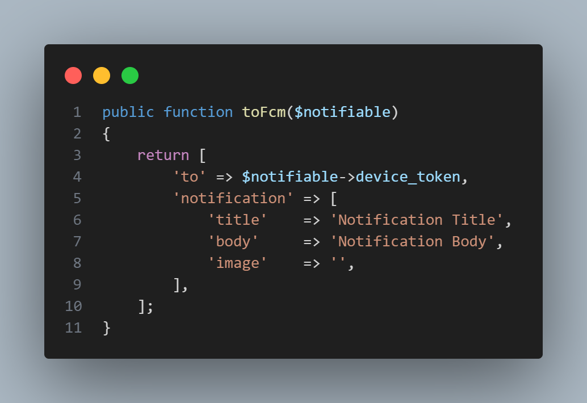

# Syntech FCM Integration in Laravel

This guide provides step-by-step instructions to integrate `Syntech\SyntechFcm` for sending Firebase Cloud Messaging (FCM) notifications in a Laravel application.

## Requirements

- PHP >= 7.4
- Laravel >= 8.0
- Composer

## Installation

1. **Install the package via Composer**:

    ```bash
    composer require syntech/syntechfcm
    ```

2. **Publish the configuration file**:

    ```bash
    php artisan vendor:publish --provider="Syntech\Syntechfcm\SyntechFcmServiceProvider"
    ```

3. **Configure your FCM credentials**:

    Update the `config/syntechfcm.php` file with your FCM project credentials.

    ```php
    return [
    'project_id'   => env('FCM_PROJECT_ID'),
    'client_email' => env('FCM_CLIENT_EMAIL'),
    'private_key'  => env('FCM_PRIVATE_KEY'),
    ];
    ```

4. **Add the FCM credentials to your `.env` file**:

    ```env
    FCM_PROJECT_ID=your-project-id
    FCM_CLIENT_EMAIL=your-client-email
    FCM_PRIVATE_KEY=your-private-key
    ```

 
## Create and Send Notifications

1. **Create a notification**:

    ```bash
    php artisan make:notification YourNotification
    ```

2. **Implement the notification class**:

    ```php
    <?php

    namespace App\Notifications;

    use Illuminate\Bus\Queueable;
    use Illuminate\Contracts\Queue\ShouldQueue;
    use Illuminate\Notifications\Notification;

    class YourNotification extends Notification
    {
        use Queueable;

        /**
         * Create a new notification instance.
         *
         * @return void
         */
        public function __construct()
        {
            //
        }

        /**
         * Get the notification's delivery channels.
         *
         * @param  mixed  $notifiable
         * @return array
         */
        public function via($notifiable)
        {
            return ['fcm'];
        }

        /**
         * Get the FCM representation of the notification.
         *
         * @param  mixed  $notifiable
         * @return array
         */
        public function toFcm($notifiable)
        {
            return [
                'to' => $notifiable->device_token,
                'notification' => [
                    'title'    => 'Notification Title',
                    'body'     => 'Notification Body',
                    'image'    => '', // Optional image URL
                ],
            ];
        }
    }
    ```

    ```php
    <?php

    namespace App\Models;

    use Illuminate\Database\Eloquent\Model;
    use Illuminate\Notifications\Notifiable;

    class User extends Model
    {
        use Notifiable;

        /**
         * Route notifications for the FCM channel.
         *
         * @return string
         */
        public function routeNotificationForFcm()
        {
            return $this->device_token;
        }
    }
    ```

3. **Send the notification**:

    Use the notification in your controller or wherever appropriate:

    ```php
    use App\Notifications\YourNotification;
    use App\Models\User;

    // Assuming $user is an instance of the User model
    $user = User::find(1); // Find the user you want to notify
    $user->notify(new YourNotification($title, $body));
    
    ```

## Example Usage

1. **Store FCM tokens**:

    Ensure you have a way to store FCM tokens for each user, typically in your `users` table.

    ```php
    Schema::table('users', function (Blueprint $table) {
        $table->string('device_token')->nullable();
    });
    ```

2. **Update FCM tokens**:

    Update the user's FCM token when they log in or register.

    ```php
    $user->update(['device_token' => $request->input('device_token')]);
    ```

3. **Send a test notification**:

    In a controller method:

    ```php
    public function sendTestNotification(User $user)
    {
        $user->notify(new YourNotification());
    }
    ```

## License

This project is open-source and available under the [MIT license](LICENSE).

## Contributing

Contributions are welcome! Please read the [contribution guidelines](CONTRIBUTING.md) first.

## Support

For support, open an issue or contact the maintainer.

## Example Code Image

Below is an example of the `toFcm` method implementation in your notification class:


